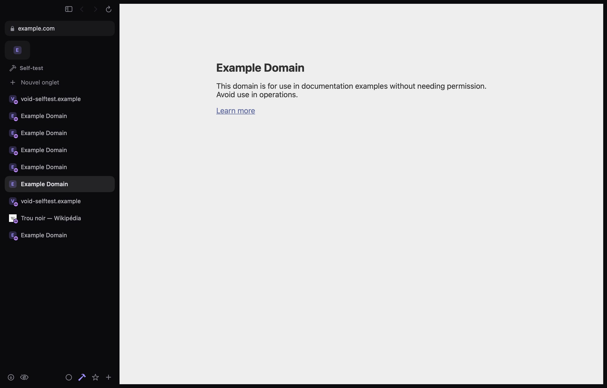

# Void

**Un navigateur qui s'efface.** Version **0.1** (préversion). Void est un navigateur macOS minimaliste : une page, quelques pixels de chrome autour, rien d'autre. Il s'appuie sur WebKit, le moteur de macOS — pas de Chromium, pas d'Electron.

- Swift + SwiftUI, AppKit là où c'est utile (WKWebView, fenêtres, menus contextuels)
- Apple silicon, macOS 14 minimum
- **≈ 6 Mo** (build Release, image disque de 2,4 Mo), aucune dépendance externe (SQLite et CommonCrypto viennent du système)
- ~10 900 lignes de Swift (dont ~1 800 d'auto-tests), ~770 lignes de JavaScript injecté



## Compiler et lancer

Prérequis : Xcode 16 ou plus récent (projet au format « dossiers synchronisés » ; testé avec Xcode 27), un Mac Apple silicon.

**Avec Xcode** : ouvrir `Void.xcodeproj`, choisir le schéma *Void* → *My Mac*, puis ⌘R.

**En ligne de commande** :

```bash
xcodebuild -project Void.xcodeproj -scheme Void -configuration Release -derivedDataPath build/DerivedData build
```

```bash
open build/DerivedData/Build/Products/Release/Void.app
```

Pour l'installer, copier `Void.app` dans `/Applications`, ou créer une image disque :

```bash
./scripts/make-dmg.sh
```

Le script compile en Release et produit `build/Void-<version>.dmg`, soit `build/Void-0.1.dmg` pour cette version (Void + raccourci vers Applications, à glisser-déposer). L'image n'est pas versionnée dans le dépôt : la recréer avec le script.

La signature est ad hoc (« Sign to Run Locally »), sans compte développeur. Pour distribuer l'app, renseigner une équipe dans *Signing & Capabilities* ; cela permet aussi au trousseau d'utiliser le *data protection keychain* (sinon macOS peut redemander l'accès aux mots de passe après chaque recompilation).

L'icône est générée par script (`swift scripts/make-icon.swift`).

## Raccourcis

| Action | Raccourci |
|---|---|
| Nouvel onglet | ⌘T |
| Nouvelle fenêtre / fenêtre privée | ⌘N / ⌘⇧N |
| Barre d'adresse (URL, recherche, historique, favoris, onglets, téléchargements) | ⌘L |
| Fermer l'onglet (un onglet épinglé est mis en veille) / la fenêtre | ⌘W / ⌘⇧W |
| Rouvrir l'onglet fermé | ⌘⇧T |
| Ouvrir un lien dans un nouvel onglet | ⌘-clic (arrière-plan), ⌘⇧-clic (premier plan), clic milieu, clic droit → « Ouvrir le lien dans un nouvel onglet » |
| Onglet 1…8 / dernier | ⌘1…⌘8 / ⌘9 |
| Onglet suivant / précédent | ⌃⇥ / ⌃⇧⇥ (ou ⌘⇧] / ⌘⇧[) |
| Épingler l'onglet | ⌥⌘D |
| Espace suivant / précédent | ⌃⌘→ / ⌃⌘← ou balayage à deux doigts sur la barre d'onglets |
| Picture in Picture | ⌘⇧P |
| Mode lecture | ⌘⇧R |
| Masquer un élément | ⌘⇧H |
| Web Inspector / console JavaScript | ⌥⌘I / ⌥⌘J |
| Favori / favoris | ⌘D / ⌥⌘B |
| Historique / téléchargements | ⌘Y / ⌥⌘L |
| Rechercher dans la page | ⌘F, ⌘G, ⌘⇧G |
| Barre latérale / garder les onglets masqués (révélés au bord gauche) | ⌃⌘S / ⌘S |
| Recharger / sans cache | ⌘R / ⌥⌘R |
| Zoom | ⌘+ ⌘− ⌘0 |

## État des fonctionnalités (honnête)

Légende : ✅ terminé **et vérifié par un test automatisé** dans l'app réelle · ☑️ terminé, vérifié à la compilation et à la relecture, mais pas par un test automatisé · 🟡 partiel · ❌ non implémenté.
Rapports de test : [`docs/selftest/features.md`](docs/selftest/features.md) et [`docs/PIP_TEST_REPORT.md`](docs/PIP_TEST_REPORT.md).

### Terminé et testé
- ✅ **Onglets en barre latérale ou en haut** (réglage + menu Présentation), animation de sélection (`matchedGeometryEffect`). Captures dans `docs/selftest/`.
- ✅ **Réglages → Onglets** : barre latérale redimensionnable (double-clic sur le bord : largeur par défaut), onglets masqués jusqu'au bord gauche (⌘S), lettres ou icônes de sites, barre de favoris (dossiers en menus), progression de lecture, mise en veille des onglets inactifs après 30 min (retour à la même position et au même historique ; onglets épinglés, sonores, en appel ou avec du texte saisi exclus), gestion des espaces. Tout s'applique en direct et est mémorisé.
- ✅ **Personnalisation au premier lancement** : apparence (thème, couleur), position et style des onglets, barre latérale visible ou masquée jusqu'au bord, barre de favoris ; chaque choix s'applique en direct derrière la carte. Réglages → Général → « Revoir… » la relance.
- ✅ **Couleur d'accent** (violet, bleu, vert, orange, rose), centralisée dans `Theme.swift`, contraste vérifié en thème clair et sombre.
- ✅ **Onglets épinglés** (favicon ou lettre), conservés après fermeture ; **⌘W met un onglet épinglé en veille** (vue web libérée), un clic le réveille.
- ✅ **Espaces** avec icône et **stockage séparé** (`WKWebsiteDataStore(forIdentifier:)`) — isolation des cookies vérifiée.
- ✅ **Barre d'adresse unique** : URL ou recherche, suggestions de l'historique, des favoris, des onglets ouverts et des téléchargements ; centrée sur la page (et non sur la fenêtre entière, barre latérale comprise), elle se rétrécit dans une fenêtre étroite.
- ✅ **Ouvrir dans un nouvel onglet** : ⌘-clic, liens `target=_blank`, menu contextuel (« Ouvrir le lien dans un nouvel onglet », « …en arrière-plan », « …dans une fenêtre privée »).
- ✅ **Mode lecture** : extraction de l'article et de ses images (y compris images chargées tardivement), affichage épuré sans JavaScript, taille du texte réglable.
- ✅ **Bloqueur de publicités** en `WKContentRuleList` (≈ 150 règles, blocage avant chargement, sans script), désactivable par site.
- ✅ **Masquer un élément** (⌘⇧H) : sélection au survol, masquage durable par site via une règle compilée ; gestion dans Réglages → Confidentialité.
- ✅ **Fenêtres privées** (⌘⇧N) : tous les onglets de la fenêtre partagent un `WKWebsiteDataStore.nonPersistent()` propre à la fenêtre, détruit à sa fermeture ; ni historique, ni session, ni suggestions d'historique, ni enregistrement de mot de passe ; téléchargements hors historique ; pas d'épinglage ni d'espaces ; extensions désactivées par défaut ; barre ardoise et badge « Privé ».
- ✅ **Plusieurs fenêtres** (⌘N) : mêmes espaces et même stockage que la fenêtre principale.
- ✅ **Robustesse et sécurité** (branche `nuit-conseil`, voir [`docs/CONSEIL.md`](docs/CONSEIL.md)) :
  - mots de passe remplis uniquement dans le cadre de l'origine enregistrée (jamais de repli sur le cadre principal) ;
  - session relue même abîmée ou d'un format plus récent ; fichier illisible mis de côté, copie de secours ;
  - barre d'adresse sur la page réellement affichée (pas une navigation en cours), cadenas seulement si toute la page est chiffrée ;
  - alertes JS d'un onglet en arrière-plan sans blocage de l'app, plantage de page sans boucle de rechargement, onglet épinglé jamais supprimé par un téléchargement, veille réelle d'un épinglé en PiP ;
  - téléchargements : noms nettoyés (inversion bidirectionnelle, fichiers cachés), pas de collision, quarantaine garantie ; liens vers d'autres apps confirmés, refusés depuis un cadre intégré, `smb:`/`ssh:`… refusés ;
  - historique SQLite en WAL, titres inchangés non réécrits ; copies temporaires de l'import supprimées.
- ✅ **Stabilité** (branche `corrections-stabilite`, section `stabilite` de l'auto-test) :
  - **authentification HTTP** (routeurs, NAS, intranets) : nom d'utilisateur et mot de passe demandés en feuille sur l'onglet affiché, avertissement si la connexion n'est pas chiffrée ; un onglet en arrière-plan reçoit la page 401 du serveur (un rechargement redemande) ;
  - **fenêtre principale fermée** : ses pages s'arrêtent (plus de son sans fenêtre, PiP fermé) et reviennent avec leur historique à la réouverture ; un lien venu d'une autre app rouvre la fenêtre ;
  - **mémoire basse** : onglets inactifs mis en veille après 5 min (tout de suite si la mémoire est critique) au lieu de 30 ;
  - **vidéo retirée de la page** pendant sa lecture (fils Reddit/X, lecteur fermé) : l'onglet n'est plus considéré « en lecture », il peut de nouveau se mettre en veille et n'est plus gardé actif derrière la page ;
  - **bloqueur** : des changements rapides de réglage installent une seule liste, la dernière, sans trou de blocage pendant la compilation ;
  - ⌘W sur un épinglé en PiP puis retour immédiat : la page reste ; un espace supprimé qui était le seul d'une fenêtre ⌘N y est remplacé ; formulaire de connexion oublié au changement de page.
  - ☑️ Vérifié à la relecture seulement : quitter avec des téléchargements en cours demande confirmation ; extensions : plus d'onglet fantôme après fermeture, désactivation respectée pendant leur chargement, autorisations demandées en feuille (plus de fenêtre modale bloquante) ; favicons limités à 512 Ko et téléchargés hors du fil principal ; menu contextuel sans lien d'un clic droit précédent.
- ✅ **Picture in Picture** manuel, automatique et plan B — voir [le compte rendu](docs/PIP_TEST_REPORT.md).
- ✅ **Lecteurs vidéo** (branche `lecteurs-video`, sections `plein-ecran` et `lecteurs` de l'auto-test ; vidéos générées sur place, sans réseau) :
  - **plein écran d'une vidéo sans écran noir** : WebKit place la vue web dans sa propre fenêtre ; Void n'y touche plus tant que dure le plein écran (un changement de lecture la ramenait dans la fenêtre de Void : écran noir, puis page blanche à la sortie) ; fermer l'onglet en plein écran ferme aussi cette fenêtre ;
  - **touches sans bip** : une touche que la page ne traite pas (flèche dans un lecteur, page qui ne défile pas, plein écran) n'aboutit plus au son « action impossible » de macOS ; les touches traitées par la page et les raccourcis ⌘ fonctionnent comme avant ;
  - **état de lecture juste** : suivi par document et non plus par adresse (un site qui passe à la vidéo suivante sans recharger, comme YouTube, laissait l'onglet « en lecture » : pas de mise en veille, PiP automatique sur une vidéo en pause) ; lecteurs dans un *shadow DOM* (Reddit, composants web) suivis ;
  - **clic droit → « Télécharger le fichier lié / l'image / la vidéo »** : le téléchargement démarre (WebKit le confiait à une méthode que Void n'avait pas : il ne se passait rien).
- ✅ **Extensions Chrome** (macOS 15.4+, `WKWebExtension`, même interface WebExtensions que Chrome : `chrome.*`, Manifest V3 et V2, service worker) :
  - installation depuis le **Chrome Web Store** : sur la page d'une extension, le bouton « Ajouter à Chrome » (inactif hors de Chrome) est remplacé par **« Ajouter à Void »** / « Retirer de Void » ; ou un lien/identifiant dans Réglages → Extensions (« Ouvrir le Store »), depuis un fichier **.crx**, .zip ou un dossier, ou **importées de Chrome, Brave, Edge ou Arc** ; Void garde sa propre copie (`Extensions/`), une réinstallation met à jour en gardant les données ;
  - onglets et fenêtres de Void exposés aux extensions (`chrome.tabs`, `chrome.windows` : requêtes, création, activation, déplacement, épinglage, son, mode lecture, événements) ; scripts de contenu, `declarativeNetRequest`, stockage, page d'options dans un onglet, menus contextuels (`chrome.contextMenus`) ;
  - bouton 🧩 toujours présent : en bas de la barre latérale, à droite dans la barre du haut ; liste des extensions avec leur badge, popups d'action (au-dessus du bouton en bas de la barre latérale), accès au Store ; les popups sont **redimensionnables** (poignée dans le coin opposé au bouton ; taille retenue par extension, double-clic : taille d'origine), et ceux d'au moins 480 px de large (gestionnaires de mots de passe…) s'ouvrent 25 % plus grands — WebKit les limitait à la taille de leur contenu (800 × 600 au plus), et un popup qui s'adapte à la place qu'on lui donne, comme Proton Pass, restait à sa taille minimale ; autorisations optionnelles demandées au moment voulu ;
  - compatibilité Chrome → WebKit : Void ajoute à sa copie de l'extension un petit script (`extension-shim.js`) chargé en premier dans son script d'arrière-plan, ses pages et ses scripts de contenu. Il garde à WebKit ses objets `chrome`/`browser` (certaines extensions, dont Proton Pass, les remplacent une fois lancées pour masquer l'API : WebKit ne pouvait alors plus leur transmettre aucun message ni événement), fournit des substituts inertes aux API que WebKit n'a pas (`runtime.onUpdateAvailable`, `offscreen`, `sidePanel`…), dont l'absence arrêtait tout le script d'arrière-plan, et donne à `tabs.getCurrent()` la réponse de Chrome dans un popup (aucun onglet : WebKit renvoyait l'onglet sous le popup, et Proton Pass, se croyant dans un onglet, réduisait son popup à 50 × 50). Une extension venue du Store a son identifiant Chrome comme `chrome.runtime.id`, pour que ses sites puissent lui parler (`externally_connectable` : connexion à Proton Pass depuis account.proton.me) ; une extension installée avant ce changement prend son identifiant Chrome au lancement suivant, et repart avec des données vierges ;
  - vérifié par l'auto-test avec une extension MV3 empaquetée en .crx : installation, script de contenu, `chrome.tabs.query`, `chrome.tabs.create`, page d'options reliée au script d'arrière-plan (même quand l'extension masque ses globales et utilise une API absente de WebKit), popup d'action à la taille de son contenu puis agrandi à la poignée (la page suit, taille retenue, double-clic : retour), désinstallation ; bouton « Ajouter à Void » sur la vraie page du Store. **Non testés automatiquement** : le téléchargement réel depuis le Store (vérifié à la main avec Proton Pass) et le clic à la souris sur le bouton 🧩 (le popup est ouvert par le test comme le fait ce bouton). **Non pris en charge** : messagerie native, raccourcis clavier des extensions (`commands`), remplacement de la page Nouvel onglet, et les API propres à Chrome que WebKit n'implémente pas (`sidePanel`, `offscreen`… : substituts inertes) : une extension qui en dépend fonctionnera en partie. Les scripts qu'une extension injecte elle-même (`chrome.scripting`) ne reçoivent pas `extension-shim.js`.
- ✅ **Réorganiser les onglets par glisser-déposer**, dans la barre latérale (liste et grille des épinglés) comme dans la barre du haut : les autres onglets s'écartent pendant le glissé, l'ordre (donc ⌘1…⌘9 et la session) suit. Épinglés et onglets ordinaires se réordonnent séparément ; attraper un onglet ne déplace pas la fenêtre. Dans la barre du haut, qui est la barre de titre, les zones sont nettes : un onglet se déplace, les espaces vides déplacent la fenêtre (double-clic : comme la barre de titre). Vérifié par l'auto-test avec des événements souris envoyés à la fenêtre (onglet déplacé, fenêtre immobile ; zone vide : fenêtre déplacée).
- ✅ **Changer la position des onglets** (barre latérale ↔ barre du haut) sans perdre la page : pendant l'animation, les deux zones de page coexistent et seule la dernière arrivée dans la fenêtre tient les pages (l'ancienne gardait parfois la page en disparaissant : page blanche). Vérifié par l'auto-test (bascules animées, rapides et lentes).

### Terminé, non testé automatiquement
- ☑️ **Barre du haut** : mêmes outils que la barre latérale — extensions, fenêtre privée, téléchargements, et menu des espaces (changer d'espace, en créer un).
- ☑️ **Web Inspector** (`isInspectable`, « Inspecter l'élément » au clic droit). ⌥⌘J ouvre la console via une API interne de WebKit (`_inspector`), appelée avec garde-fous.
- ☑️ **Mots de passe dans le trousseau macOS** : détection des formulaires, proposition d'enregistrement, remplissage (icône clé 🔑 ; le verrouillage par origine est, lui, testé) et affichage/copie dans les Réglages **derrière Touch ID** (repli : mot de passe de la session).
- ☑️ **Réglages** : navigateur par défaut, moteur de recherche (7 + personnalisé), position des onglets, thème sombre (par défaut)/clair/système, restauration des onglets, PiP automatique.
- ☑️ **Balayage à deux doigts** pour changer d'espace (sur la barre latérale ou la barre d'onglets ; dans la page, le balayage reste « précédent/suivant »). Un geste trackpad ne peut pas être simulé de façon fiable par le test.
- ☑️ Historique (SQLite), favoris, téléchargements (dans ~/Téléchargements, progression, rebond du Dock), recherche dans la page, zoom, impression, pop-ups/`window.open`, alertes JS, envoi de fichiers, liens `mailto:`/`tel:` vers les apps système (les autres apps après confirmation).

### Partiel
- 🟡 **Import** — Chrome, Arc, Brave, Edge : favoris, historique, mots de passe (déchiffrés avec la clé « Safe Storage » du trousseau, après accord de macOS). Arc : les éléments de la barre latérale sont importés comme favoris. Firefox : favoris et historique ; **mots de passe uniquement via un export CSV** (Firefox les chiffre avec NSS, non réimplémenté). Le code n'a pas été exécuté contre de vrais profils (pour ne pas toucher à vos données sans accord) — à valider avec la checklist ci-dessous.
- 🟡 **Remplissage automatique** : formulaires classiques et React ; pas de gestion des formulaires en plusieurs étapes complexes ni des passkeys.

### Non implémenté
- 🟡 Fenêtres supplémentaires (⌘N) : leurs onglets ne sont pas restaurés au relancement (seule la fenêtre principale l'est) ; épinglage et gestion des espaces depuis la fenêtre principale uniquement.
- ❌ Synchronisation entre appareils, cartes bancaires, passkeys, gestion fine des permissions par site.
- ❌ Durée de conservation de l'historique : il est gardé indéfiniment (la recherche de ⌘L ralentira sur un très gros historique).
- ❌ Listes de blocage externes (EasyList…) et blocage des publicités YouTube intégrées au flux vidéo.

## Checklist manuelle rapide (hors PiP)
1. ⌘T → taper `apple.com` → Entrée ; ⌘T → taper `trou noir` → recherche.
2. ⌘-clic sur un lien → nouvel onglet en arrière-plan ; clic droit → « Ouvrir le lien dans un nouvel onglet ».
3. Glisser un onglet plus bas dans la barre latérale → les autres s'écartent, la fenêtre ne bouge pas ; relancer Void → l'ordre est conservé. Même chose avec deux onglets épinglés, puis en mode « onglets en haut » (glisser vers la droite).
4. Ouvrir la page d'une extension sur chromewebstore.google.com → 🧩 dans la barre d'adresse → « … ajoutée » ; 🧩 (en bas de la barre latérale) → l'extension → son popup s'ouvre au-dessus du bouton (sous le bouton dans la barre du haut).
5. Épingler un onglet (⌥⌘D), ⌘W → il passe en veille ; quitter/relancer Void → il est toujours là.
6. Créer un espace (＋ en bas de la barre latérale), s'y connecter à un site → l'autre espace n'est pas connecté. Balayer à deux doigts sur la barre latérale pour passer d'un espace à l'autre.
7. ⌘⇧R sur un article (Wikipédia, un journal) ; ⌘⇧H puis cliquer une bannière → recharger : elle reste masquée.
8. Se connecter à un site → « Enregistrer le mot de passe ? » → Enregistrer ; se déconnecter → icône 🔑 → Touch ID → champs remplis. Réglages → Mots de passe → Touch ID → affichage.
9. Réglages → Importer → choisir un navigateur installé.
10. ⌥⌘J → la console du Web Inspector s'ouvre.
11. Réglages → Général → « Définir Void par défaut » (macOS demande confirmation).
12. Un site en authentification HTTP (routeur, NAS) → la feuille « Connexion à … » → identifiants → la page s'ouvre.
13. Lancer un gros téléchargement, ⌘Q → « Un téléchargement est en cours » → « Continuer les téléchargements » : Void reste ouvert.
14. Vidéo YouTube en cours, fermer la fenêtre principale (bouton rouge) → le son s'arrête ; ⌘N → la fenêtre revient, onglet et historique intacts.
15. Vidéo YouTube en plein écran (bouton du lecteur) → pause, lecture, flèches ← → : pas d'écran noir ni de bip ; Échap → la page revient. Clic droit sur une image → « Télécharger l'image » → elle apparaît dans les téléchargements.

## Architecture

```
Void.xcodeproj
Config/                    Info.plist (http/https, HTML), entitlements (Hardened Runtime, pas de sandbox)
Void/
  App/                     Point d'entrée SwiftUI, AppDelegate, menus et raccourcis, réglages, thème & logo
  Browser/                 Modèle : Tab (WKWebView paresseuse), Space, BrowserModel, session, résolution d'URL
  Web/                     Configuration WebKit, délégués navigation/UI, menu contextuel, APIs internes gardées
  UI/                      Fenêtre, barre latérale, barre du haut, barre de commande, hôte des vues web
  Features/
    PiP/                   PiPController (3 niveaux), FloatingPlayer (plan B)
    Reader/ AdBlock/ ElementHider/ Passwords/ Import/ Library/ Extensions/
  Settings/                Fenêtre de réglages, navigateur par défaut
  Resources/Scripts/       core.js, media.js, autofill.js, reader.js, hider.js, webstore.js (monde JS isolé « Void »),
                           extension-shim.js (copié dans chaque extension : compatibilité Chrome → WebKit)
  SelfTest/                Auto-tests PiP et fonctionnalités (compilés en Debug uniquement)
scripts/make-icon.swift    Génère l'icône
docs/                      Compte rendu PiP, rapports d'auto-test, captures
```

Choix notables :
- **Légèreté** : une seule vue web est créée au lancement (onglet visible) ; les autres onglets restent « endormis » jusqu'au clic. Règles de blocage compilées une fois puis mises en cache par WebKit.
- **Scripts dans un monde isolé** : les pages ne voient ni ne modifient les scripts de Void.
- **Extensions Chrome dans WebKit** : Void modifie uniquement sa propre copie de l'extension (`Extensions/`) pour y charger `extension-shim.js` en premier (manifeste, pages HTML, script d'arrière-plan enveloppé dans `void-background.js`) ; l'original importé d'un autre navigateur n'est jamais touché.
- **Pas de sandbox** : nécessaire pour lire les profils des autres navigateurs à l'import (comme Chrome ou Firefox, qui ne sont pas sandboxés non plus). Hardened Runtime actif.
- **APIs internes WebKit** (préférences PiP/outils de développement, ouverture de la console, taille libre des popups d'extension) : toutes appelées après `responds(to:)` ; si Apple les retire, la fonction se désactive sans plantage.

## Données
Tout est dans `~/Library/Application Support/Void/` (session, historique SQLite, favoris, éléments masqués, extensions et leurs copies dans `Extensions/`). Les mots de passe sont uniquement dans le trousseau macOS. Les données des sites sont gérées par WebKit, un magasin par espace.

## Auto-tests (build Debug)
Compiler avec un `-derivedDataPath` **hors de `~/Documents`** : iCloud y ajoute des attributs qui font échouer la signature. Les contrôles à base de clics simulés (lien `_blank`, masquage d'élément, glisser dans la barre du haut) échouent quand l'écran du Mac est verrouillé ou que la souris est utilisée pendant le test, de même que la lecture des vidéos en streaming du test PiP écran verrouillé, et parfois l'agrandissement du popup d'extension à la poignée (le test déplace le vrai pointeur) ; ce n'est pas une régression. Le cas « Repli natif WebKit seul » du test PiP échoue toujours : ce niveau n'est pas disponible sur ce WebKit (voir le compte rendu PiP).

Pour ne lancer que certaines sections : `-VoidSelfTestOnly session,onglets,telechargements,adresse,stabilite,glisser,disposition,extensions,plein-ecran,barre-commande,lecteurs`.

```bash
build/DerivedData/Build/Products/Debug/Void.app/Contents/MacOS/Void -VoidSelfTest features -VoidSelfTestOut /tmp/void-features.md
```
```bash
build/DerivedData/Build/Products/Debug/Void.app/Contents/MacOS/Void -VoidSelfTest pip -VoidSelfTestOut /tmp/void-pip.md
```
